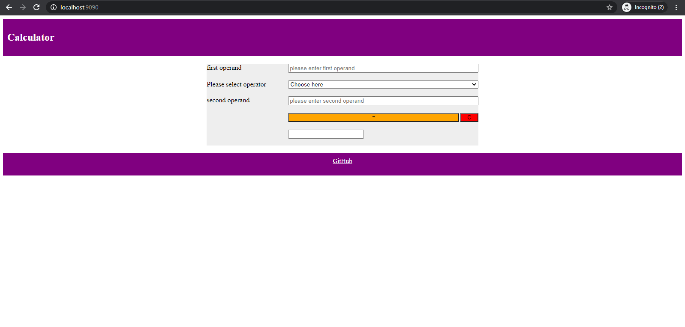

# calculator_design

In this project, I am creating web-based calculator application in Golang. During implementation, I have followed MVC (Model-View-Controller) architectural pattern for separating the logic of each module.

## Class Diagram


The program is organized in three packages:

1. **Model**
    * Calculator:  
      
      This class contains the main logic of application. In our case, it implements all core functionalities (like addition, subtraction, etc.) of calculator.
2. **Controller**
    * CalculatorController:  
       
        This class mainly responsible for calling specific struct methods from Model package based on user request, and updating view at the same time. In our application, user will call `PerformOperation()` method of this class for every operation by clicking `submit` button. `PerformOperation()` method decides which method to call from Model struct.

        By this way, user will not directly interact with structs inside Model package. Instead, it will only interact with structs inside Controller package.
3. **View**
    * CalculatorView:

        This struct contains necessary variables used while displaying calculator. Values of this struct's membor variables are initialized and updated by `CalculatorController`.

        This struct also contains `ShowCalc()` method, which executes `calculator_view.html` file and loads the current object for displaying existing values. 

    * calculator_view:

        This HTML file is used for User Interaction. It will show values to user by loading `CalculatorView` struct variables.

        Each button requests different methods from `CalculatorController` struct. So, user will interact with Controller by filling up and submitting the form.
4. **Main**  
  
   Main program instantiates objects of structs from Model, View and Controller packages. Then, it reserves specific port (9090 in our case) for running the application.

## To-do list

- [x] make view package for UI and building html template in it.
- [x] unit testing.
- [x] error handling for preventing bad user input.
- [ ] Implementing the similar functionalities using REST API.
- [ ] Implementing Design Pattern once this project gets many functionalities to handle.

## Running Application



First of all, you will need to clone this repository using following command:

```
git clone https://github.com/rachitt96/calculator_design.git
cd calculator_design
```

Now, there are two ways in order to run this application as explained below:

1. **Installing Go manually**

    In this method, we will need to ensure that Go is installed in the local machine. If it is not installed, then we will need to download and install specific [installer](https://golang.org/doc/install) based on machine's operating system.

    Check if Go is installed by running following command:
    ```
    go version
    ```

    Use following command in order to run this application after installing Go:
    ```
    go run main_program.go
    ```


2. **Using Docker container (recommended)**

    In this method, we don't need to worry about installing Go for a specific OS, but we need to ensure that Docker Desktop is installed.

    Run the following command in order to build the linux container for our application:

    ```
    docker build -t go_web_calculator:latest .
    ```

    Run the following command to run our container and binding the port 9090, which is used by our application.

    ```
    docker run --rm -p 9090:9090 go_web_calculator:latest
    ```

Type this URL in web browser.
```
localhost:9090
```