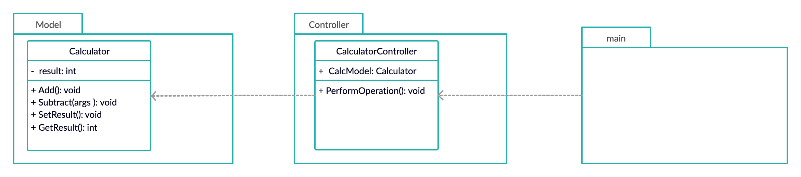

# calculator_design

In this project, I created calculator in Golang and used MVC architecture pattern for separating the logic of every module.

### Class Diagram



The program is organized into mainly two packages:

1. Model
    * Calculator:  
      
      This class contains the main logic of application. In our case, it implements all core functionalities (like addition, subtraction, etc.) of calculator.
2. Controller
    * CalculatorController:  
       
        This class mainly responsible for calling specific struct methods from Model package based on user request. In our application, user will call `PerformOperation()` method of this class irrespective of operation, and `PerformOperation()` method decides which method to call from Model.

        By this way, user will not directly interact with structs inside Model package. Instead, it will only interact with structs inside Controller package.
3. Main  
  
   Main program instantiates structs of Model and Controller packages. Then, it takes user inputs from console and call `PerformOperation()` method of `CalculatorController` class.

### To-do list

- [ ] make view package for UI and building html template in it.
- [ ] unit testing.
- [ ] create Exception functionality for handling bad user input.
- [ ] Implementing Design Pattern once project get many functionalities to handle.

### Running Application

Use following commands in order to run this application after cloning this repository:
```
go run main_program.go
```