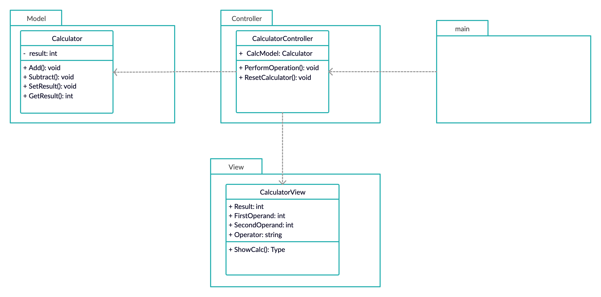

# calculator_design

In this project, I am creating web-based calculator in Golang and using MVC architecture pattern for separating the logic of every module.

## Class Diagram



The program is organized in three packages:

1. **Model**
    * Calculator:  
      
      This class contains the main logic of application. In our case, it implements all core functionalities (like addition, subtraction, etc.) of calculator.
2. **Controller**
    * CalculatorController:  
       
        This class mainly responsible for calling specific struct methods from Model package based on user request, and updating view at the same time. In our application, user will call `PerformOperation()` method of this class for every operation by clicking `submit` button. `PerformOperation()` method decides which method to call from Model struct.

        By this way, user will not directly interact with structs inside Model package. Instead, it will only interact with structs inside Controller package.
3. **View**
    * CalculatorView:

        This struct contains necessary variables used while displaying calculator. Values of this struct's membor variables are initialized and updated by `CalculatorController`.

        This struct also contains `ShowCalc()` method, which executes `calculator_view.html` file and loads the current object for displaying existing values. 

    * calculator_view:

        This HTML file is used for User Interaction. It will show values to user by loading `CalculatorView` struct variables.

        Each button requests different methods from `CalculatorController` struct. So, user will interact with Controller by filling up and submitting the form.
4. **Main**  
  
   Main program instantiates objects of structs from Model, View and Controller packages. Then, it reserves specific port (9090 in our case) for running the application.

## To-do list

- [x] make view package for UI and building html template in it.
- [ ] unit testing.
- [ ] create Exception functionality for handling bad user input.
- [ ] Implementing Design Pattern once project get many functionalities to handle.

## Running Application

Use following command in order to run this application after cloning this repository:
```
go run main_program.go
```
Type this URL in webbrowser.
```
localhost:9090
```